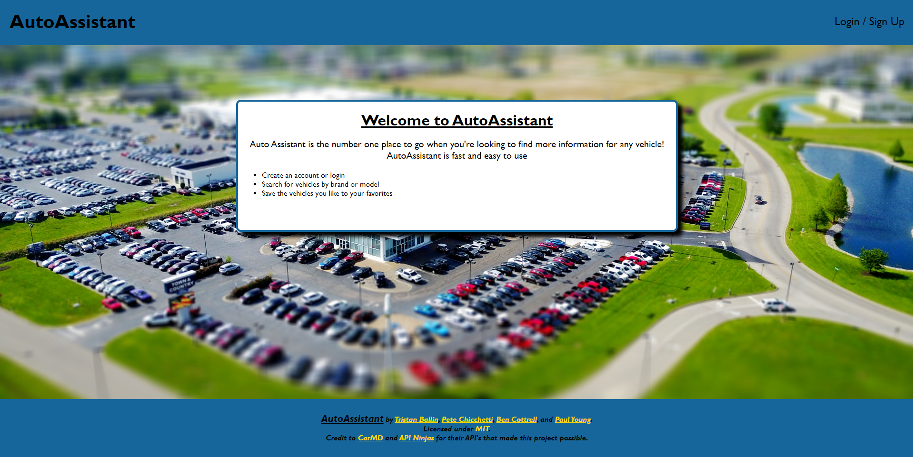
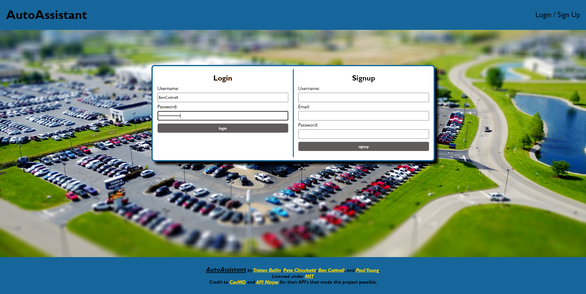
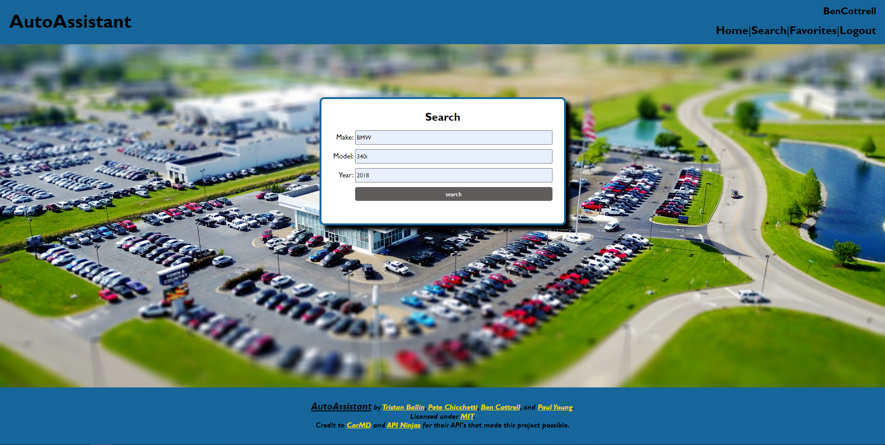
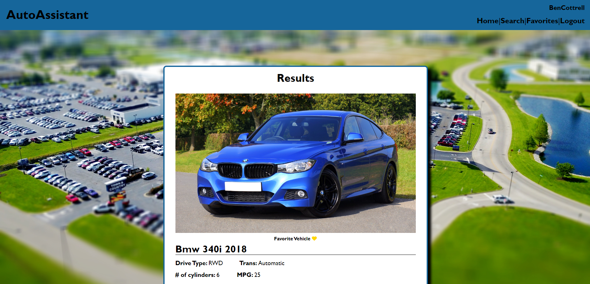
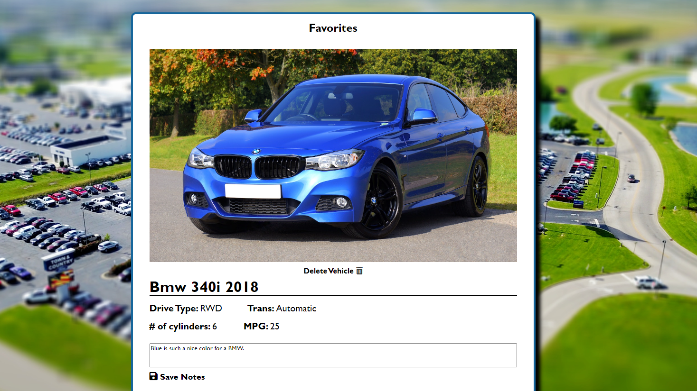

# AutoAssistant

## Description

AutoAssistant is a site to search for a car using make, model, and year. Once you have signed up and gotten logged in, you may begin your search. The search returns any results matching your search, and allows you to favorite cars that you like. Once favorited, a favorites page can be visited with all your favorited cars. Also available on the favorites page is a section where you can add notes about each individual car, allowing you to keep your thoughts about them, or to use for comparison.

AutoAssistant was built on the express handlebars templating engine, utilizing both NodeJS and Express.js to create a RESTful API. MySQL was used with the Sequelize ORM to create a database. AutoAssistant was styled with CSS, and drew from the [API Ninjas' Car API](https://api-ninjas.com/api/cars) to obtain the make, model, year, drive type, transmission, cylinders in the engine, and combined (highway/city) mpg. Animations for the favorite and save buttons were done with Animate.css.

Our CRUD process is as follows: 

- Begin with a GET to the welcome page.
- Create a user with a POST to /api/users on submission of the sign up form.
- On successful sign up or login, GET to the search page at /search. The user can then search for a car using make/model/year.
- A subsequent POST to /results creates any new matching results on the page with the parameters listed in the description above.
- Once a user gets their results back, they are able to favorite cars by clicking a heart icon, which then does a POST to /favorites.
- When the user clicks on the Favorites tab in the nav bar, they GET to /favorites and are shown the cars they have favorited from prior searches.
- The user may then add notes to the cars they have favorited, via a PUT to update the notes section beneath the displayed car.
- It is possible to then remove favorites by clicking a trash can icon underneath the car's image, utilizing a DELETE to do so.

## Criteria

The following was the criteria laid out for this project:

```
Use Node.js and Express.js to create a RESTful API.

Use Handlebars.js as the templating engine.

Use MySQL and the Sequelize ORM for the database.

Have both GET and POST routes for retrieving and adding new data.

Be deployed using Heroku (with data).

Use at least one new library, package, or technology that we haven’t discussed.

Have a polished UI.

Be responsive.

Be interactive (i.e., accept and respond to user input).

Have a folder structure that meets the MVC paradigm.

Include authentication (express-session and cookies).

Protect API keys and sensitive information with environment variables.

Have a clean repository that meets quality coding standards (file structure, naming conventions, follows best practices for class/id naming conventions, indentation, quality comments, etc.).

Have a quality README (with unique name, description, technologies used, screenshot, and link to deployed application).
```

## Link

[Application Link](https://young-retreat-27760.herokuapp.com)

[Repository](https://github.com/BenjaminCottrell/auto-assistant)

## Screenshots






## License

MIT License

Copyright (c) 2022 ThatBallinGuy, BenjaminCottrell, PeteChichetti

Permission is hereby granted, free of charge, to any person obtaining a copy
of this software and associated documentation files (the "Software"), to deal
in the Software without restriction, including without limitation the rights
to use, copy, modify, merge, publish, distribute, sublicense, and/or sell
copies of the Software, and to permit persons to whom the Software is
furnished to do so, subject to the following conditions:

The above copyright notice and this permission notice shall be included in all
copies or substantial portions of the Software.

THE SOFTWARE IS PROVIDED "AS IS", WITHOUT WARRANTY OF ANY KIND, EXPRESS OR
IMPLIED, INCLUDING BUT NOT LIMITED TO THE WARRANTIES OF MERCHANTABILITY,
FITNESS FOR A PARTICULAR PURPOSE AND NONINFRINGEMENT. IN NO EVENT SHALL THE
AUTHORS OR COPYRIGHT HOLDERS BE LIABLE FOR ANY CLAIM, DAMAGES OR OTHER
LIABILITY, WHETHER IN AN ACTION OF CONTRACT, TORT OR OTHERWISE, ARISING FROM,
OUT OF OR IN CONNECTION WITH THE SOFTWARE OR THE USE OR OTHER DEALINGS IN THE
SOFTWARE.
